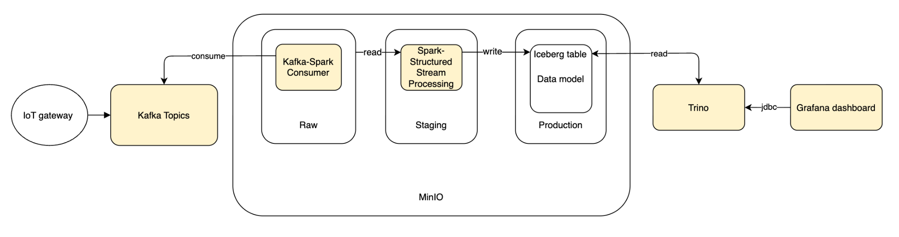

# IoT Data Platform

A near real-time IoT data pipeline built with Kafka, Apache Spark Structured Streaming, MinIO (Data Lakehouse), Trino, and Grafana. IoT sensor data is simulated using the [Open-Meteo](https://open-meteo.com/) weather API and processed through a full ingestion → transformation → serving pipeline.

---

## Architecture Overview



```
┌─────────────────────────────────────────────────────────────────────────┐
│                        INGESTION LAYER                                  │
│                                                                         │
│   ┌──────────────────┐     ┌──────────────────┐                        │
│   │  IoT Gateway 1   │     │  IoT Gateway 2   │   (Docker containers)  │
│   │  device_1        │     │  device_2        │                        │
│   │  Berlin (52.52N  │     │  Paris (48.85N   │                        │
│   │        13.41E)   │     │       2.35E)     │                        │
│   └────────┬─────────┘     └────────┬─────────┘                        │
│            │    Open-Meteo API      │                                   │
│            └───────────┬────────────┘                                   │
│                        ▼                                                │
│              ┌──────────────────┐                                       │
│              │      Kafka       │  (Distributed durable buffer)         │
│              │  (+ Zookeeper)   │                                       │
│              └────────┬─────────┘                                       │
└───────────────────────┼─────────────────────────────────────────────────┘
                        │
┌───────────────────────┼─────────────────────────────────────────────────┐
│               PROCESSING & STORAGE LAYER                                │
│                        │                                                │
│            ┌───────────┴────────────┐                                   │
│            ▼                        ▼                                   │
│  ┌──────────────────┐   ┌───────────────────────┐                      │
│  │ kafka-consumer-  │   │   Spark Structured    │                      │
│  │      raw         │   │      Streaming        │                      │
│  │  (raw JSON dump) │   │  (transform & model)  │                      │
│  └────────┬─────────┘   └──────────┬────────────┘                      │
│           │                        │                                    │
│           ▼                        ▼                                    │
│  ┌─────────────────────────────────────────────┐                       │
│  │                   MinIO                     │                       │
│  │  ┌──────────┐  ┌──────────┐  ┌──────────┐  │                       │
│  │  │   raw/   │  │staging/  │  │warehouse/│  │                       │
│  │  │  (JSON)  │  │          │  │(Iceberg) │  │                       │
│  │  └──────────┘  └──────────┘  └──────────┘  │                       │
│  └─────────────────────────────────────────────┘                       │
└───────────────────────┬─────────────────────────────────────────────────┘
                        │
┌───────────────────────┼─────────────────────────────────────────────────┐
│                  SERVING LAYER                                          │
│                        ▼                                                │
│              ┌──────────────────┐                                       │
│              │      Trino       │  (Distributed SQL query engine)       │
│              └────────┬─────────┘                                       │
│                        ▼                                                │
│              ┌──────────────────┐                                       │
│              │     Grafana      │  (Real-time dashboards)               │
│              └──────────────────┘                                       │
└─────────────────────────────────────────────────────────────────────────┘
```

---

## Data Source

### Open-Meteo API

Sensor data is simulated by periodically polling the [Open-Meteo Forecast API](https://open-meteo.com/). Weather parameters serve as direct analogues to physical IoT sensors:

| API Parameter | Simulated Sensor | Unit |
|---|---|---|
| `temperature_2m` | Temperature sensor | °C |
| `relative_humidity_2m` | Humidity sensor | % |
| `apparent_temperature` | Perceived temperature | °C |
| `pressure_msl` | Barometric pressure sensor | hPa |
| `surface_pressure` | Surface pressure sensor | hPa |
| `wind_speed_10m` | Anemometer | km/h |
| `wind_direction_10m` | Wind vane | ° |
| `wind_gusts_10m` | Gust meter | km/h |
| `precipitation` | Rain gauge | mm |
| `cloud_cover` | Cloud sensor | % |
| `weather_code` | Condition code | WMO |

Each IoT gateway container queries a different geographic coordinate, simulating distributed IoT devices in the field.

---

## Pipeline Stages

### 1. Ingestion Layer

- Each **IoT Gateway** runs as an independent Docker container and periodically calls the Open-Meteo API.
- The raw JSON response is enriched with system metadata (`iot_device_id`, `ingestion_time`) and published to a **Kafka topic** via the Kafka Producer API.
- **Kafka** acts as a distributed durable buffer, decoupling data producers from consumers and enabling horizontal scalability and fault tolerance.

### 2. Processing & Storage Layer

**Raw Zone** — A `kafka-consumer-raw` process reads JSON records from Kafka and writes them directly to the `raw/` bucket in MinIO as-is.

**Transformation** — A Spark Structured Streaming job reads from the Raw Zone and performs:
- **Deduplication** based on event time
- **Datetime normalization** to ISO 8601
- **NULL value standardization**

**Production Zone (Dimensional Model)** — Cleaned data is modeled into a star schema and stored in the `warehouse/` bucket on MinIO using Apache Iceberg:

| Table | Description |
|---|---|
| `dim_date` | Time dimension |
| `dim_iot_device` | Device dimension (derived from container `DEVICE_ID` env var) |
| `dim_country` | Country/region dimension (derived from coordinates) |
| `fact_measurements` | Fact table with measurement data and foreign keys to all dimension tables |

### 3. Serving Layer

- **Trino** connects to MinIO via the Iceberg connector and exposes the warehouse tables for interactive SQL queries.
- **Grafana** connects to Trino over JDBC to render near real-time monitoring dashboards.

---

## Services & Ports

| Service | Container | Port |
|---|---|---|
| Zookeeper | `zookeeper` | 2181 |
| Kafka Broker | `kafka` | 9092 |
| MinIO API | `minio` | 9000 |
| MinIO Console | `minio` | 9001 |
| Trino | `trino` | 8080 |
| Grafana | `grafana` | 3000 |

**MinIO default credentials:** `admin` / `password123`  
**Grafana default credentials:** `admin` / `admin`

---

## Project Structure

```
iot-data-platform/
├── docker-compose.yaml          # Full stack orchestration
├── iot-gateway/                 # IoT gateway (Open-Meteo → Kafka producer)
│   ├── producer.py
│   ├── requirement.txt
│   └── Dockerfile
├── kafka-spark-consume/         # Kafka consumer → MinIO raw zone
│   ├── consumer.py
│   ├── requirement.txt
│   └── Dockerfile
├── spark-stream/                # Spark Structured Streaming (transform + load)
├── trino/                       # Trino configuration
│   ├── config.properties
│   └── catalog/
│       └── iceberg.properties   # Iceberg connector pointing to MinIO
└── grafana/
    └── provisioning/            # Grafana datasource & dashboard provisioning
```

---

## Prerequisites

- [Docker](https://docs.docker.com/get-docker/) and [Docker Compose](https://docs.docker.com/compose/install/)

---

## Getting Started

```bash
# Clone the repository
git clone <repo-url>
cd iot-data-platform

# Start all services
docker compose up -d

# Check service logs
docker compose logs -f iot-gateway-1
docker compose logs -f spark-stream
```

Access the UIs:
- **MinIO Console:** http://localhost:9001
- **Trino UI:** http://localhost:8080
- **Grafana:** http://localhost:3000

---

## Raw Event Schema

Each event published to Kafka by an IoT gateway has the following top-level structure (sourced from the Open-Meteo API response):

```json
{
  "latitude": 52.52,
  "longitude": 13.419998,
  "timezone": "GMT",
  "elevation": 38.0,
  "current": {
    "time": "2026-04-22T14:15",
    "interval": 900,
    "temperature_2m": 17.7,
    "relative_humidity_2m": 31,
    "apparent_temperature": 13.4,
    "is_day": 1,
    "precipitation": 0.0,
    "rain": 0.0,
    "showers": 0.0,
    "snowfall": 0.0,
    "weather_code": 1,
    "cloud_cover": 40,
    "pressure_msl": 1023.9,
    "surface_pressure": 1019.3,
    "wind_speed_10m": 15.0,
    "wind_direction_10m": 325,
    "wind_gusts_10m": 35.3
  },
  "iot_device_id": "device_1",
  "ingestion_time": "2026-04-22T14:15:03Z"
}
```

The Spark Structured Streaming job flattens the `current` object and joins it with `latitude`, `longitude`, `iot_device_id`, and `ingestion_time` to produce the final fact records.
